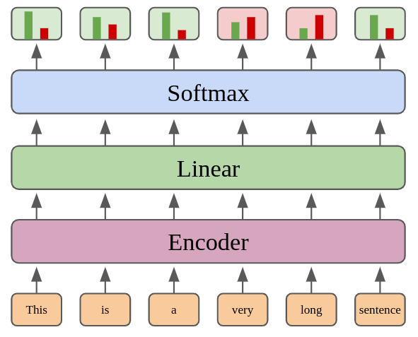

# Sentence Compression with Reinforcement Learning

Code for the ACL 2022 paper [Efficient Unsupervised Sentence Compression by Fine-tuning Transformers with Reinforcement Learning](https://arxiv.org/abs/2205.08221).

Model architecture used in this work:



### Install `scrl` library
The library is used for training, producing summaries with existing models and for evaluation and works with Python 3.7/3.8.

1. Create environment <br>
`conda create -n my_env python=3.8` with conda, or with venv: `python3.8 -m venv <env path>` <br>

2. Activate the environment <br>
`conda activate my_env` with conda, otherwise: `source <env path>/bin/activate`

3. Install dependencies & library in development mode: <br>
`pip install -r requirements.txt` <br>
`pip install -e .`

### Data
The full contents of the `data` folder can be found in [this google drive folder](https://drive.google.com/drive/folders/1grkgZhtdd-Bw45GAnHza9RRb5OVQG4pK?usp=sharing).
In particular, `models` are required to use and evaluate our trained models, `train-data` to train new models, and `hc-outputs` to analyse/evaluate outputs of the hill climbing baseline.

### Using a model

We trained 3 models which were used in our evaluation:
* `gigaword-L8` - trained to predict summaries of 8 tokens; trained on Gigaword to match preprocessing of test set
* `newsroom-L11` - trained to predict summaries of 11 tokens
* `newsroom-P75` - trained to reduce sentences to 75% of their original length

To use a trained model in Python, we need its model directory and the correct pretrained model ID for the tokenizer corresponding to the original pretrained model that the sentence compression model was initialised with:
```python
from scrl.model import load_model
from transformers import AutoTokenizer

# model_dir = "data/models/gigaword-L8/"
# model_dir = "data/models/newsroom-L11/"
model_dir = "data/models/newsroom-P75/"
device = "cpu"
model = load_model(model_dir, device)
tokenizer = AutoTokenizer.from_pretrained("distilroberta-base")
sources = [
  """
  Most remaining Covid restrictions in Victoria have now been removed for those who are fully vaccinated, with the state about to hit its 90% vaccinated target.
  """.strip()
]
summaries = model.predict(sources, tokenizer, device)
for s in summaries:
	print(s)
```

You can run this code with [example.py](example.py)


### Training a new model

A new model needs a new config file (examples in [config](config)) for various settings, e.g. training dataset, reward functions, model directory, steps.


`python bin/train.py --verbose --config config/example.json --device cuda`

You can also change the device to `cpu` to try it out locally.

Training can be interrupted with `Ctrl+C` and continued by re-running the same command which will pick up from the latest saved checkpoint. Add `--fresh` to delete the previous training progress and start from scratch.


### Evaluation

The evaluation results can be replicated with the following Make commands, which run with slightly different settings depending on the dataset:

```bash
make eval-google MODELDIR=data/models/newsroom-L11
make eval-duc2004 MODELDIR=data/models/newsroom-L11
make eval-gigaword MODELDIR=data/models/gigaword-L8
make eval-broadcast MODELDIR=data/models/newsroom-P75
make eval-bnc MODELDIR=data/models/newsroom-P75
```

To evaluate on a custom dataset, check out [bin/evaluate.py](bin/evaluate.py) and its arguments.


### Hill Climbing Baseline

We implemented a search-based baseline for sentence compression using hill climbing, based on [Discrete Optimization for Unsupervised Sentence Summarization with Word-Level Extraction](https://arxiv.org/abs/2005.01791).  A difference to the original method is that we only restart the search if no unknown neighbour state can be found, i.e. dynamically instead of in equal-paced intervals.

**Producing summaries**<br>
The budget of search steps is controlled with `--steps`.
```bash
python bin/run_hc.py \
    --config config/hc.json \
    --steps 10 \
    --target-len 11 \
    --dataset data/test-data/google.jsonl \
    --output data/hc-outputs/example.jsonl \
    --device cpu
```


**Evaluation** <br>

For datasets used in the paper:
```bash
make hc-eval-google HC_OUTPUT=data/hc-outputs/hc.L11.google.jsonl
make hc-eval-duc2004 HC_OUTPUT=data/hc-outputs/hc.L11.duc2004.jsonl
make hc-eval-gigaword HC_OUTPUT=data/hc-outputs/hc.L8.gigaword.jsonl
make hc-eval-broadcast HC_OUTPUT=data/hc-outputs/hc.P75.broadcast.jsonl
make hc-eval-bnc HC_OUTPUT=data/hc-outputs/hc.P75.bnc.jsonl
```

Example for custom dataset:
```
python bin/evaluate_hc_output.py \
    --dataset data/test-data/google.jsonl \
    --outputs data/hc-outputs/hc.L11.google.jsonl
```

### Citation

⚠️ Please refer to the version of the paper on Arxiv, there is a typo in the original ACL version (Table 3, ROUGE-1 column, Gigaword-SCRL-8 row).

```
@inproceedings{ghalandari-etal-2022-efficient,
    title = "Efficient Unsupervised Sentence Compression by Fine-tuning Transformers with Reinforcement Learning",
    author = "Gholipour Ghalandari, Demian and Hokamp, Chris and Ifrim, Georgiana",
    booktitle = "Proceedings of the 60th Annual Meeting of the Association for Computational Linguistics (Volume 1: Long Papers)",
    month = may,
    year = "2022",
    address = "Dublin, Ireland",
    publisher = "Association for Computational Linguistics",
    url = "https://arxiv.org/abs/2205.08221",
    pages = "1267--1280",
}
```
